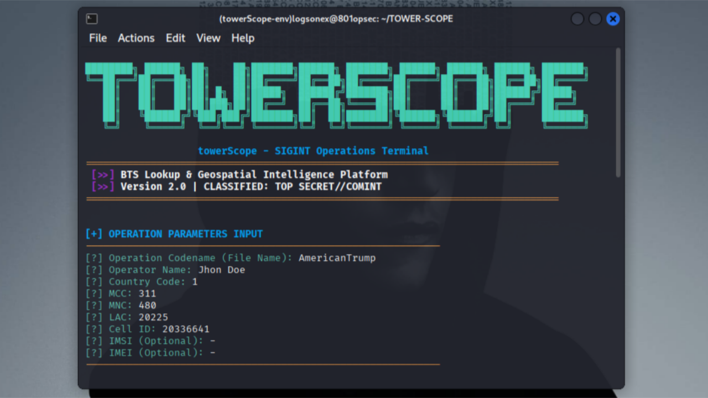
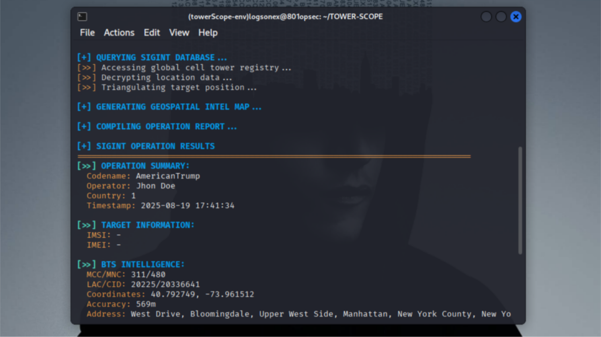
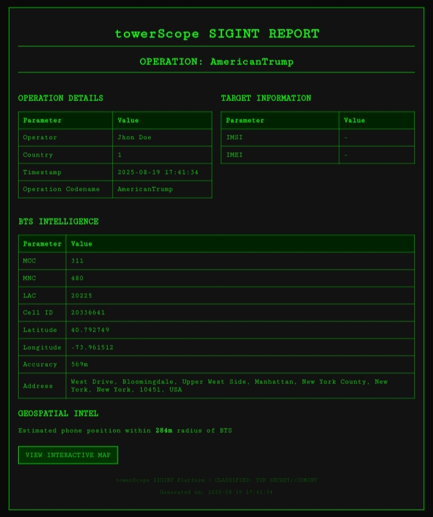
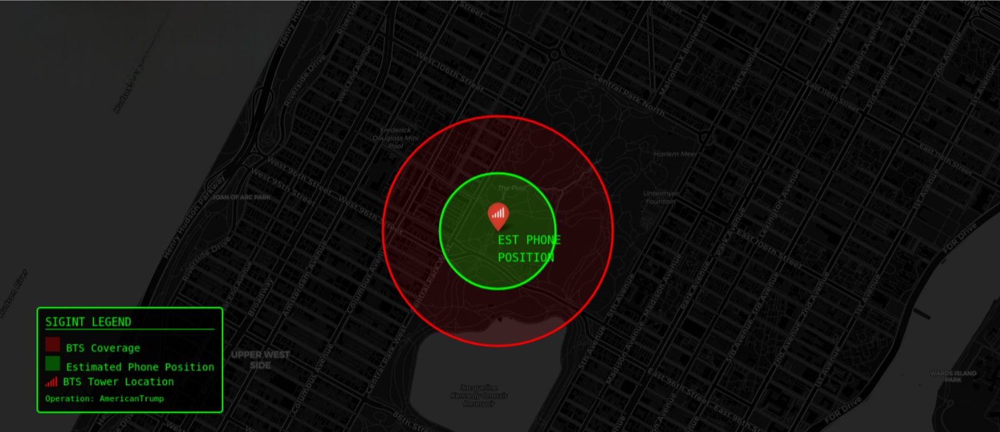

```
████████╗ ██████╗ ██╗    ██╗███████╗██████╗ ███████╗ ██████╗ ██████╗ ██████╗ ███████╗
╚══██╔══╝██╔═══██╗██║    ██║██╔════╝██╔══██╗██╔════╝██╔════╝██╔═══██╗██╔══██╗██╔════╝
   ██║   ██║   ██║██║ █╗ ██║█████╗  ██████╔╝███████╗██║     ██║   ██║██████╔╝█████╗  
   ██║   ██║   ██║██║███╗██║██╔══╝  ██╔══██╗╚════██║██║     ██║   ██║██╔═══╝ ██╔══╝  
   ██║   ╚██████╔╝╚███╔███╔╝███████╗██║  ██║███████║╚██████╗╚██████╔╝██║     ███████╗
   ╚═╝    ╚═════╝  ╚══╝╚══╝ ╚══════╝╚═╝  ╚═╝╚══════╝ ╚═════╝ ╚═════╝ ╚═╝     ╚══════╝
```
<h1 align="center"><code>TOWER-SCOPE</code></h1>

<h1 align="center"><code>Open-source BTS & Device Intelligence Toolkit</code></h1>

---

TowerScope adalah toolkit open-source untuk pengumpulan dan analisis intelijen sinyal seluler. Dirancang untuk kebutuhan SIGINT, dan investigasi teknis, TowerScope memudahkan operator, peneliti, maupun analis untuk memetakan infrastruktur BTS, dan mengidentifikasi BTS.

Dengan dukungan antarmuka interaktif dan visualisasi geospasial, TowerScope memungkinkan pengguna melakukan tracking, profiling, dan estimasi posisi secara presisi, langsung dari server lokal.

---

## ✨ Fitur Utama

| Fitur | Deskripsi |
|-------|-----------|
| 🎛️ Antarmuka Interaktif | Terminal berwarna dengan efek visual |
| 🗺️ Visualisasi Geospasial | Peta interaktif dengan estimasi posisi BTS & perangkat |
| 📑 Laporan Profesional | Generate laporan HTML & CSV |
| 🌍 Server Lokal | Hosting peta via `localhost` untuk akses mudah |
| 📡 Estimasi Cerdas | Perhitungan radius posisi handphone (100–300m dari BTS) |
| 🖥️ Multi-Platform | Kompatibel dengan Windows, macOS, & Linux |

---

## 📟 Terminal Output (CLI)


```bash
Hasil eksekusi tools di CLI:
```




---

## 📑 Report Hasil Lookup

```bash
Berikut adalah ringkasan hasil pencarian BTS:
```



---

## 🗺️ Maps Visualisasi


```bash
Peta lokasi BTS berdasarkan hasil lookup:
```



---

## 📦 Requirements

| Komponen | Versi Minimum |
|----------|---------------|
| Python   | 3.8+ |
| pip      | 21+ |
| OS       | Windows / macOS / Linux |
| Browser  | Chrome / Firefox (untuk peta interaktif) |

---

## ⚙️ Instalasi

```bash
# Clone repository
git clone https://github.com/LogsOneX/TowerScope
cd TowerScope

# Install dependencies
pip install -r requirements.txt

# Jalankan TowerScope
python src/TowerScope.py
```

---

## ⚙️ Virtual Environment (Rekomendasi)

```bash
# Clone repository
git clone https://github.com/LogsOneX/TowerScope
cd TowerScope

# Jalankan setup script (Linux/macOS)
chmod +x scripts/setup_environment.sh
./scripts/setup_environment.sh

# Aktifkan virtual environment
source TowerScope-env/bin/activate

# Jalankan TowerScope
python src/TowerScope.py
```

---

## 🚀 Usage

```bash
python src/TowerScope.py
```

---

### Masukkan parameter operasi:

| Parameter |              |
|----------|---------------|
| Operation Codename | nama untuk file output |
| Operator Name | nama operator |
| Country Code | kode negara, contoh: 62 untuk Indonesia |
| MCC | Mobile Country Code, contoh: 510 untuk Indonesia |
| MNC | Mobile Network Code, contoh: 10 untuk Telkomsel |
| LAC | Location Area Code |
| Cell ID | Cell Identity |
| IMSI dan IMEI | opsional |

Tunggu proses analisis
- Aplikasi akan mengquery database OpenCellID/UnwiredLabs
- Generate peta dan laporan
- Tampilkan hasil di terminal

---

## 🔧 Konfigurasi API

TowerScope memerlukan API key dari UnwiredLabs untuk mengakses database menara seluler:
- Daftar akun di UnwiredLabs
- Verifikasi email dan dapatkan API key dari dashboard
- Konfigurasi API key dengan salah satu metode berikut:

---

## Metode 1: Environment Variable (Rekomendasi)

```bash
export OPENCELLID_API_KEY="your_api_key_here"
```

## Metode 2: File Konfigurasi

```bash
cp config/config.example.py config/config.py
# Edit config.py dan tambahkan API key Anda
```

---

## 📚 Library yang Digunakan

TowerScope dibangun dengan library Python berikut:
- **Requests** - HTTP requests untuk API calls
- **Folium** - Visualisasi peta interaktif
- **Colorama** - Pewarnaan output terminal
- **Python Standard Library** - Modul bawaan Python

---

## 📚 Credits

- 📡 **UnwiredLabs** – data BTS global
- 🗺️ **Folium/Leaflet** – peta interaktif
- 🎨 **Colorama** – warna terminal
- 🐍 **Python** – ekosistem library

---

## ⚠️ Penafian

TowerScope dirancang untuk tujuan edukasi, penelitian, dan keamanan yang sah. Pengguna bertanggung jawab penuh atas penggunaan alat ini dan harus memastikan mereka memiliki otorisasi yang tepat sebelum melakukan pelacakan atau kegiatan pengumpulan intelijen apa pun. Pengembang tidak bertanggung jawab atas penyalahgunaan.

---
